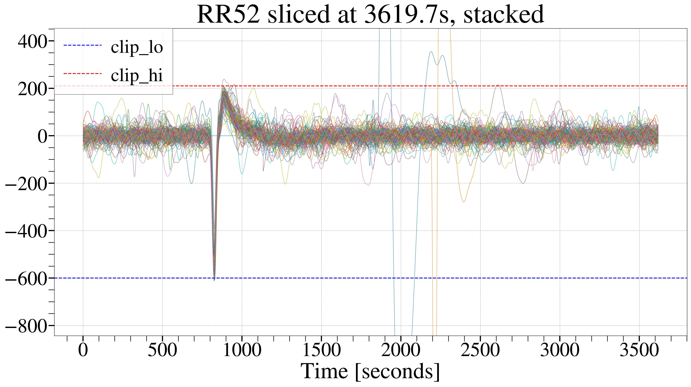
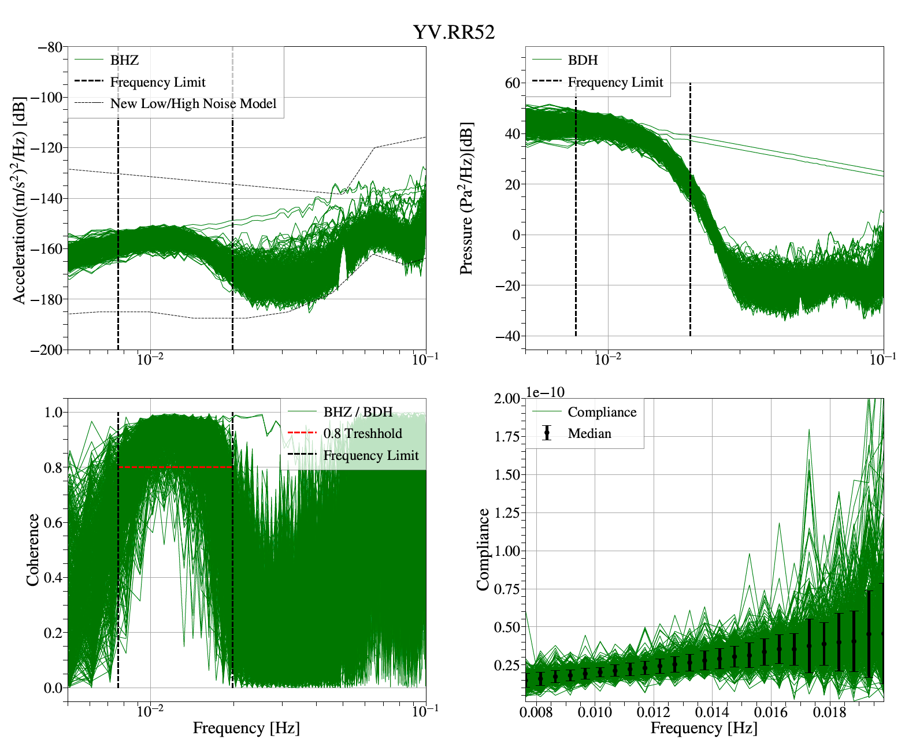

# ComPy 2.0

**Seafloor compliance processing, pressure-gauge calibration and layered elastic inversion.**

<p align="center"></p>

[](https://github.com/MohammadAmin-Aminian/ComPy/actions/workflows/tests.yml)
[](https://zenodo.org/doi/10.5281/zenodo.13380107)

ComPy was developed for broadband ocean-bottom stations in the RHUM-RUM
experiment. It supports earthquake/transient preprocessing through TiSKitPy,
tilt correction, teleseismic differential pressure gauge (DPG) calibration,
compliance estimation and Metropolis sampling of layered shear-velocity models.

The scientific study is [Aminian et al. (2025), Geophysical Journal
International](https://doi.org/10.1093/gji/ggaf253). Version 2 is a software
revision of the research code, **not a claim that the published results have
been reproduced with the revised implementation**. Changes that affect
numerical results are described in [CHANGELOG.md](CHANGELOG.md).

## Installation

Python 3.10 or later is required. A virtual environment is recommended.

```bash
git clone https://github.com/MohammadAmin-Aminian/ComPy.git
cd ComPy
python -m venv .venv
source .venv/bin/activate
python -m pip install -e '.[dev]'
python -m pytest -q
```

On Windows, activate with `.venv\Scripts\activate`.
The distribution is named `seafloor-compy`; the existing module imports remain
`compy`, `inv_compy`, `Pressure_calibration` and `ffplot`. This repository is
installed from source; the installation command does not assume a PyPI release.

Runtime dependencies are NumPy, SciPy, Matplotlib, ObsPy, TiSKitPy 2.3 and disba.
No external CPS executable is required by the built-in compliance propagator.
Imports do not contact station services. Data download, automatic earthquake
catalog retrieval and station-depth lookup require network access.

## Input conventions

| Operation | Vertical channel | Pressure channel | Other inputs |
|---|---|---|---|
| `Calculate_Compliance*` | response-corrected **displacement, m** | nominal response-corrected pressure, **Pa** | positive water depth, m; multiplicative pressure gain |
| `calculate_spectral_ratio` | raw counts; response removed internally to acceleration | raw counts; response removed internally to pressure | response inventory, earthquake windows |
| `Rotate` | physically consistent seismic channels | passed through cleaning workflow | `*1`, `*2`, `*Z` seismic channels |
| `calc_norm_compliance` / inversion | measured normalized compliance, **1/Pa** | not used directly | Hz, m; model columns below |
| `phase_dispersion` | not used | not used | disba model in **km, km/s, km/s, g/cm³** |

`*Z` denotes the vertical component and `*H` the pressure channel (normally
`BDH`), not a horizontal seismometer. ComPy expects exactly one of each for
spectral processing. Use one station and one response epoch at a time. Merge
trace fragments and resolve gaps explicitly before analysis. Masked samples,
nonfinite data, duplicate trace IDs, unequal sample rates and off-grid start
times are rejected by the core processing helpers.

For inversion and the elastic forward calculation the model columns are:

```text
[finite-layer thickness (m), density (kg/m³), Vp (m/s), Vs (m/s)]
```

The last row is an elastic half-space; its thickness does not enter the
propagator. Use zero there in custom models. The preserved station templates
retain their historical last-row thickness, which is also ignored physically.
Do not pass a disba model directly to the elastic compliance solver.

Pressure gain is defined as `calibrated_pressure = gain_factor * nominal_pressure`.
Consequently pressure PSD is multiplied by `gain_factor**2`. Apply the gain
once. Instrument-response removal is separate from pressure calibration.

## Processing workflow

1. Download/read seismic and pressure data together with their StationXML
   response inventory; check response epochs, units, timing and gaps.
2. Decimate with an anti-alias filter and remove the appropriate instrument
   responses. Use displacement for compliance and acceleration for calibration.
3. Identify earthquake intervals and periodic transients using TiSKitPy.
4. Correct seismic tilt and horizontal coherent noise.
5. Estimate the pressure gain from suitable teleseismic Rayleigh windows.
6. Estimate compliance in complete windows and inspect the quality selection.
7. Supply defensible observation uncertainties and a starting model to inversion.
8. Inspect multiple chains, burn-in, mixing and model sensitivity before
   reporting a scientific result.

The files in [`_Example/`](./_Example/) show command-line workflows and a runnable
offline synthetic example. Paths and network/station selection must match your
own data; no station-specific gain should be transferred to another sensor.

### Earthquakes and periodic transients

TiSKitPy 2.3 accepts the time bounds as a tuple:

```python
import tiskitpy

spans = tiskitpy.TimeSpans.from_eqs(
    (zdata.stats.starttime, zdata.stats.endtime),
    minmag=5.5,
    days_per_magnitude=0.5,
    save_eq_file=False,
)
```

Periodic transients require a configured **instance**, including transient
period, timing and clipping parameters; they are not class-level operations.
Use the deployment-specific example and the
[TiSKitPy documentation](https://tiskitpy.readthedocs.io/latest/) to configure it.

<p align="center"></p>

### Tilt correction

```python
import compy

rotated, azimuth, angle, variance_ratio = compy.Rotate(
    displacement_stream, time_window=1, plot=False
)
```

`time_window` is in hours. The function processes complete, non-overlapping
windows and returns a merged ObsPy Stream. The final incomplete window is
omitted. `variance_ratio` means **after / before**, so values below one mean
reduced vertical variance. A failure identifies the affected window and raises
an exception; failed windows are not silently returned as cleaned data. The
input stream is copied. TiSKitPy supports additional orientation conventions;
this wrapper uses numbered horizontal components (`*1`, `*2`).

### Pressure calibration

```python
import Pressure_calibration as dpg

gain = dpg.calculate_spectral_ratio(
    raw_stream,
    mag=7,
    f_min=0.03,
    f_max=0.07,
    inventory=inventory,
    event_spans=spans,
    plot_condition=True,
)
```

Omitting `inventory` downloads response metadata; omitting `event_spans`
retrieves earthquake windows using TiSKitPy. Supply both for offline processing.
Each event is processed independently, including a single-event dataset.
Calibration compares measured P/a divided by `rho * water_depth` with the
water-column theoretical ratio. The positive least-squares gain is fitted
analytically rather than searched in increments of 0.01. The strongest vertical
amplitude is used as a window-selection heuristic; this is not a seismic travel
time calculation. Visually check that the selected energy is Rayleigh-wave
energy. A calibration band crossing an invalid theoretical response is rejected.

Calibration coherence thresholds use **magnitude-squared coherence**. Compliance
outputs use **amplitude coherence**, its square root. These thresholds are not
interchangeable.

<p align="center"></p>

### Compliance

```python
curves, coherence, windows, frequency, full_frequency, scatter = (
    compy.Calculate_Compliance_beta(
        displacement_pressure_stream,
        depth=4000,
        gain_factor=gain,
        time_window=2,
        f_min_com=0.007,
        f_max_com=0.02,
        nseg=4096,
        plot=False,
    )
)
```

Providing `depth` avoids station-service calls. If omitted, depth is determined
from the vertical channel's elevation at the record start time.

| Function | Return tuple | Processing-window step |
|---|---|---|
| `Calculate_Compliance_beta` | curves, amplitude coherence, selected streams, selected frequencies, full frequencies, standard deviation across curves | 5 minutes |
| `Calculate_Compliance` | same first five items, peak-to-peak scatter, first-window theoretical uncertainty estimate | 1 minute |

`curves` has shape `(accepted_windows, frequency_bins)`. `coherence` contains
full-frequency arrays matching the selected windows. Beta returns frequencies
from 0.001–0.1 Hz; the older estimator returns 0.005–0.025 Hz. The requested
compliance band controls selection. Restrict results to the physically useful
band before inversion; returning a bin does not establish that it is reliable.

The default spectral segment length is 4096 samples, with 50% segment overlap
and a Hann window. All auto- and cross-spectra use the same mean-Welch estimator.
Frequency spacing is `sampling_rate / nseg`; `nseg` must fit inside each complete
processing window. Quality selection retains the historical station-oriented
coherence and pressure/vertical PSD gates; these are empirical gates, not
universal thresholds for every deployment. No accepted windows produces a clear
`ValueError`.

Gravity-wave wavenumber solves `omega² = g*k*tanh(k*H)` with a bounded root
solver. The gravity correction converts wave-attraction acceleration to
compatible displacement units before combining it with Z/P. The acceleration
correction constant is `3.07e-6 s⁻²`.

**Scatter is not standard error.** Theoretical uncertainty uses amplitude
coherence, `abs(eta)*sqrt(1-gamma²)/(gamma*sqrt(2*n))`. Zero coherence yields
infinite uncertainty. Overlapping spectral segments and processing windows
are correlated; the nominal average count does not by itself supply an
independent effective sample count. Include calibration uncertainty separately.

<p align="center"></p>

### Forward model and inversion

```python
import numpy as np
import inv_compy as inv

model = np.array(
    [
        [100, 2200, 3000, 1500],
        [1000, 2800, 6000, 3500],
        [0, 3300, 8000, 4500],
    ],
    dtype=float,
)
f = np.array([0.005, 0.007, 0.010, 0.015])
prediction = inv.calc_norm_compliance(4000, f, model)

chain, profiles, prior, misfit, predictions, likelihood, acceptance = (
    inv.invert_compliance_beta(
        measured_compliance,
        f,
        4000,
        starting_model=model,
        s=measurement_uncertainty,
        iteration=10000,
        sigma_v=5,
        sigma_h=5,
        alpha=0.25,
        seed=0,
        return_profiles=False,
    )
)
```

`chain` has shape `(layers, 4, iterations)`; `predictions` has shape
`(iterations, frequencies)`; `misfit` and `likelihood` have shape `(1, iterations)`.
`prior` is the initial Vs profile sampled on a fixed metre grid. `profiles` is
`None` when `return_profiles=False`; otherwise it contains the depth profiles
for every saved iteration. **For long runs, disable profiles:** 100,000 profiles
on a 30-km metre grid require approximately 24 GB just for that array.

The starting state is evaluated before proposals. The supplied starting model
is honored. Density and Vp remain fixed, following the paper's model description;
Vs and finite-layer thickness are sampled. The half-space remains fixed and
thickness transfers conserve total finite-layer depth. Proposals outside the
support are rejected without redraw or reflection, preserving a symmetric
Gaussian random walk. Acceptance uses differences of log probabilities, so
an underflowed stored likelihood does not break sampling. The returned acceptance
rate counts proposals, excluding the initial state. `seed` controls a local RNG
and does not reset NumPy's global generator.

The Gaussian data term is `sum(((observed-predicted)/s)**2)`; roughness is the
squared second-derivative energy on a fixed 1-m grid. The data term is a sum,
whereas the manuscript describes a mean chi-square: alpha values therefore
need retuning rather than copying unchanged. The basic sampler bounds Vs to
50–110% of its initial value. Beta uses 15–120% in shallow layers and 90–110%
in the deepest finite layer. No monotonic-Vs constraint or gain parameter is
sampled automatically. These priors must suit your scientific question.

`s` is required and must be finite and strictly positive. It may be scalar or
match the data vector. It is fixed during a chain. The sampler returns the
unnormalized likelihood for compatibility; it is not Bayesian evidence.
Station templates from `Model_V2` support 3/6/9/12 subdivisions for the eight
RHUM-RUM stations. Supply a custom model to control sediment properties;
legacy `sediment_thickness` arguments do not modify station templates.
Historical misspellings `invert_compliace*`, `liklihood`, `Roughness` and
`Comliance_uncertainty` remain available for existing notebooks.

## Plotting and diagnostics

`ffplot` contains the original PSD, coherence, spectrogram and deployment-specific
publication plotting routines. `ffplot.compl` is a quick **uncorrected** compliance
diagnostic; use `Calculate_Compliance*` for quality selection and gravity terms.
`coherogram_spectrogram_daily` exposes the former single-stream routine that
was accidentally overwritten by a second function of the same name.

Publication layouts expect the original inversion containers and adequate
post-burn-in samples. `final_plot(..., image_dir=...)` additionally requires
`RR36.png`, `RR38.png`, `RR40.png`, `RR50.png`, `RR52.png` and `Rift_valley.png`.
No plotting routine writes to the author's desktop. Export explicitly with
`matplotlib.pyplot.savefig(...)`. Serpentinization plots assume that velocity
anomalies arise from serpentinization; they do not establish that interpretation.

## Validation and reproducibility

```bash
MPLBACKEND=Agg python -m pytest -q
python -m ruff check .
python -m ruff format --check .
python -m build
```

The regression suite tests dispersion-relation residuals, a homogeneous elastic
half-space limit, identical-layer splitting, known spectral transfer functions,
gravity units, calibration scaling, event handling, sampler state consistency,
RNG isolation, window boundaries and MiniSEED round trips. GitHub Actions runs
these checks across Python 3.10–3.13. Local validation details and scientific
references are in [docs/VALIDATION.md](docs/VALIDATION.md).

Synthetic tests establish specific properties. They do not replace response
verification, real-data regression, independent forward-solver comparison,
posterior convergence or reproduction of the published station results.

## Citation

If you use ComPy, cite the scientific article and record the exact software
commit/version. The Zenodo badge links the existing archived software record;
it does not certify that version 2 has been archived there.

```bibtex
@article{aminian2025shallow,
  author = {Aminian, Mohammad Amin and Crawford, Wayne and Stutzmann, Éléonore
            and Montagner, Jean-Paul and Cannat, Mathilde and Hadziioannou, Céline},
  title = {Shallow crustal structures of the Indian ocean derived from compliance function analysis},
  journal = {Geophysical Journal International},
  year = {2025},
  volume = {242},
  number = {3},
  pages = {ggaf253},
  doi = {10.1093/gji/ggaf253}
}
```

## Contributing, license and acknowledgments

See [CONTRIBUTING.md](CONTRIBUTING.md). ComPy is licensed under
[GPL-3.0](LICENSE). Report reproducible numerical or processing issues with
units, parameters, dependency versions and a small synthetic case.

Developed at the Institut de Physique du Globe de Paris, with support from the
SPIN Innovative Training Network, funded by the European Commission under
Horizon 2020 Marie Skłodowska-Curie Actions.

<p align="center">


</p>

### Version 2.0.1 maintenance fixes

Short-record spectrogram date labels and display smoothing now adapt to available
bins. Pressure power spectra use the standard 10·log10 dB conversion. The download
example adds each decimation FIR stage to a copied response inventory and attaches
that response before deconvolution, including decimations that change only the
location code. Waveforms spanning a response-epoch boundary must be split first.
