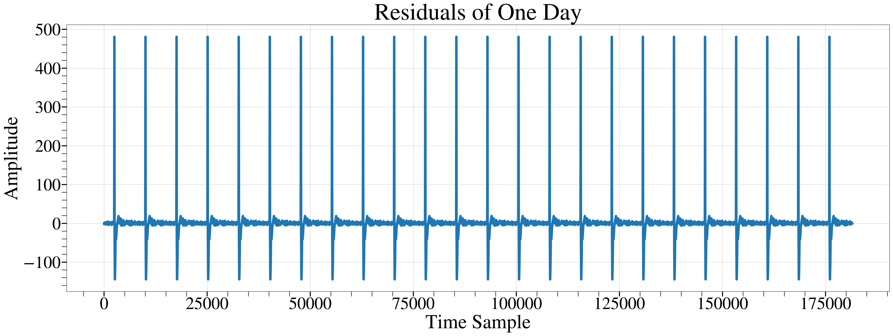

# ComPy: Seafloor Compliance Analysis Tool
<p align="center">
  
</p>


# Overview

ComPy is a specialized software tool designed for the automated processing and analysis of seafloor compliance data. It enhances the precision of subsurface shear velocity models using Broadband Ocean-Bottom Stations data from the Indian Ocean. ComPy is tailored to manage extensive data processing steps, ensuring high resolution and accuracy in geological analysis.

# Features

Automation of data pre-processing steps including glitch removal, tilt effect minimization, and pressure gauge calibration.
Implementation of the Metropolis-Hastings algorithm for robust depth-velocity inversion.
Utilization of advanced signal processing techniques to handle seafloor compliance data.

# Installation

Before installing ComPy, ensure you have Python and the necessary packages installed. ComPy requires Python 3.x.

# Clone the repository
git clone https://github.com/your-repository/ComPy.git

# Navigate to the ComPy directory
cd ComPy

# Install required Python packages
pip install numpy matplotlib scipy obspy tiskitpy

# Usage

Here's how you can use ComPy to process your seafloor compliance data:

import compy
# Generate Timespans to Avoid Because of Earthquakes

To ensure the accuracy of the compliance data, it is crucial to exclude timespans affected by significant seismic events.

## `eq_spans = tiskit.TimeSpans.from_eqs(zdata.stats.starttime, zdata.stats.endtime, minmag=5.5, days_per_magnitude=0.5, save_eq_file=False)`

**Function Overview:**
The `tiskit.TimeSpans.from_eqs` function generates timespans to exclude based on earthquake events within the data recording period. This helps in avoiding data contamination from seismic activities.

- **eq_spans**: Time spans generated to avoid due to earthquakes.
- **zdata.stats.starttime**: Start time of the data recording.
- **zdata.stats.endtime**: End time of the data recording.
- **minmag**: Minimum magnitude of earthquakes to consider.
- **days_per_magnitude**: Number of days to exclude per unit of earthquake magnitude.
- **save_eq_file**: Boolean flag to save the earthquake file or not.
<p align="center">
  
</p>
## `rt.calc_timing(zdata, eq_spans)`

**Function Overview:**
The `rt.calc_timing` function calculates and stores a list of periodic transients based on the provided timespans.

- **zdata**: The seismic data.
- **eq_spans**: Timespans to exclude due to earthquakes.
<p align="center">
  
</p>
## `rt.calc_transients(zdata, eq_spans, plot=False)`

**Function Overview:**
The `rt.calc_transients` function calculates the transient time parameters from the data within the given timespans.

- **zdata**: The seismic data.
- **eq_spans**: Timespans to exclude due to earthquakes.
- **plot**: Boolean flag to plot the results or not.

## `cleaned = rt.remove_transients(zdata, plot=False, match=False, prep_filter=False)`

**Function Overview:**
The `rt.remove_transients` function removes transients from the data based on the calculated parameters.

- **cleaned**: The data after removing transients.
- **zdata**: The seismic data.
- **plot**: Boolean flag to plot the results or not.
- **match**: Boolean flag to match the transients or not.
- **prep_filter**: Boolean flag to apply a pre-filtering process or not.
<p align="center">
  
</p>
For further information and examples, visit the [tiskitpy repository](https://github.com/WayneCrawford/tiskitpy/tree/develop/tiskitpy/rptransient).
```

## `rotated_stream,azimuth,angle,variance = compy.Rotate(stream_decim,time_window = 1)`

**Function Overview:**
The `compy.Rotate` function rotates seismic data to minimize tilt effects and removes coherence noise, enhancing data accuracy for compliance analysis. The default processing window is set to 1 hour but can be adjusted as needed.

- **rotated_stream**: The seismic data stream after rotation and noise removal.
- **azimuth**: The direction of the rotation applied to correct the tilt in degrees.
- **angle**: The angle of tilt correction applied to the seismic data.
- **variance**: The reducted variance ratio (After/Before), indicating the effectiveness of noise reduction.


<p align="center">
  
</p>

# Plotting Functions

## `fp.coherogram_spectrogram_alpha(rotated_stream)`

This function plots spectrograms that feature average values within the compliance frequency band. The output includes several panels:

- **(a) Calibrated Pressure:** Shows pressure data adjusted for calibration errors.
- **(b) Median Values of Pressure:** Displays the median values of the calibrated pressure data.
- **(c) Corrected Vertical Acceleration:** Presents the vertical acceleration data after corrections.
- **(d) Median Values of Vertical Acceleration:** Shows the median values of the corrected vertical acceleration data.
- **(e) Coherogram:** Plots the coherogram between the calibrated pressure and the corrected vertical acceleration.
- **(f) Average Values:** Illustrates the average values across the dataset. 

Black dashed lines indicate the frequency limits of the compliance band. Green shaded areas in panel (f) highlight selected time windows with coherency exceeding the coherence threshold, marked by a red dashed line set at 0.8. This visualization aids in identifying significant patterns and anomalies in the data.
<p align="center">
  
</p>

# Contributing

We welcome contributions from the community. Please review CONTRIBUTING.md for guidelines on how to submit improvements to ComPy.

# License

This project is licensed under the MIT License - see the LICENSE file for details.

# Citation
_Inference of Shallow Subsurface Structures of the Indian Ocean Derived from Compliance Function Analysis
# Acknowledgments

This tool was developed at the Institut de Physique du Globe de Paris and funded by the SPIN project, an Innovative Training Network (ITN) supported by the European Commission under the Horizon 2020 Marie Skłodowska-Curie Actions (MSCA). We extend our gratitude to all contributors and collaborators who have made this project possible.
<p align="center">
  
  
</p>


