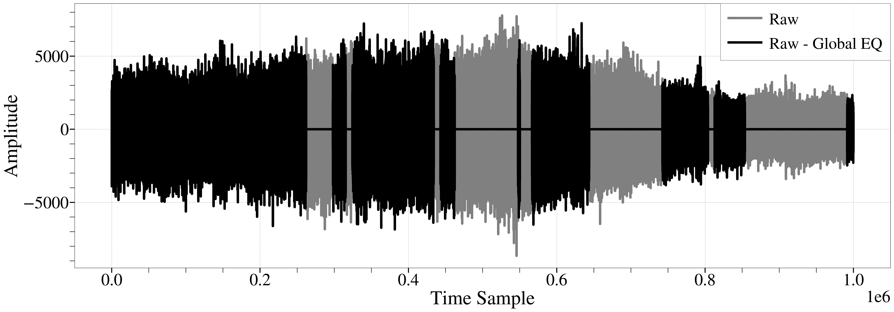
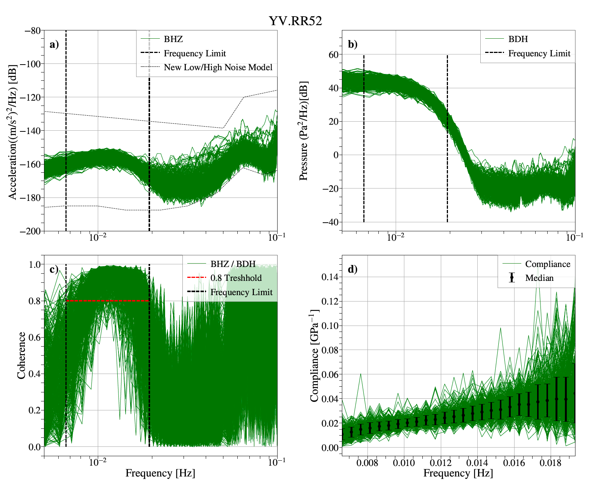

# ComPy: Seafloor Compliance Analysis Tool

  

# Overview

ComPy is a specialized software tool designed for the automated processing and analysis of seafloor compliance data. It enhances the precision of subsurface shear velocity models using Broadband Ocean-Bottom Stations data from the Indian Ocean. ComPy is tailored to manage extensive data processing steps, ensuring high resolution and accuracy in geological analysis.

# Features

Automation of data pre-processing steps including glitch removal, tilt effect minimization, and pressure gauge calibration.
Implementation of the Metropolis-Hastings algorithm for robust depth-velocity inversion.
Utilization of advanced signal processing techniques to handle seafloor compliance data.

# Installation

Before installing ComPy, ensure you have Python and the necessary packages installed. ComPy requires Python 3.x.

# Clone the repository
git clone https://github.com/your-repository/ComPy.git

# Navigate to the ComPy directory
cd ComPy

# Install required Python packages
pip install numpy matplotlib scipy obspy tiskitpy

# Usage

Here's how you can use ComPy to process your seafloor compliance data:

import compy
# Generate Timespans to Avoid Because of Earthquakes

To ensure the accuracy of the compliance data, it is crucial to exclude timespans affected by significant seismic events.

## `eq_spans = tiskit.TimeSpans.from_eqs(zdata.stats.starttime, zdata.stats.endtime, minmag=5.5, days_per_magnitude=0.5, save_eq_file=False)`

**Function Overview:**
The `tiskit.TimeSpans.from_eqs` function generates timespans to exclude based on earthquake events within the data recording period. This helps in avoiding data contamination from seismic activities.

- **eq_spans**: Time spans generated to avoid due to earthquakes.
- **zdata.stats.starttime**: Start time of the data recording.
- **zdata.stats.endtime**: End time of the data recording.
- **minmag**: Minimum magnitude of earthquakes to consider.
- **days_per_magnitude**: Number of days to exclude per unit of earthquake magnitude.
- **save_eq_file**: Boolean flag to save the earthquake file or not.

  

For further information and examples, visit the [tiskitpy repository](https://github.com/WayneCrawford/tiskitpy/tree/develop/tiskitpy/rptransient).

## `rt.calc_timing(zdata, eq_spans)`

**Function Overview:**
The `rt.calc_timing` function calculates and stores a list of periodic transients based on the provided timespans.

- **zdata**: The seismic data.
- **eq_spans**: Timespans to exclude due to earthquakes.

  

For further information and examples, visit the [tiskitpy repository](https://github.com/WayneCrawford/tiskitpy/tree/develop/tiskitpy/rptransient).

## `rt.calc_transients(zdata, eq_spans, plot=False)`

**Function Overview:**
The `rt.calc_transients` function calculates the transient time parameters from the data within the given timespans.

- **zdata**: The seismic data.
- **eq_spans**: Timespans to exclude due to earthquakes.
- **plot**: Boolean flag to plot the results or not.

## `cleaned = rt.remove_transients(zdata, plot=False, match=False, prep_filter=False)`

**Function Overview:**
The `rt.remove_transients` function removes transients from the data based on the calculated parameters.

- **cleaned**: The data after removing transients.
- **zdata**: The seismic data.
- **plot**: Boolean flag to plot the results or not.
- **match**: Boolean flag to match the transients or not.
- **prep_filter**: Boolean flag to apply a pre-filtering process or not.

  

For further information and examples, visit the [tiskitpy repository](https://github.com/WayneCrawford/tiskitpy/tree/develop/tiskitpy/rptransient).

## `rotated_stream,azimuth,angle,variance = compy.Rotate(stream_decim,time_window = 1)`

**Function Overview:**
The `compy.Rotate` function rotates seismic data to minimize tilt effects and removes coherence noise, enhancing data accuracy for compliance analysis. The default processing window is set to 1 hour but can be adjusted as needed.

- **rotated_stream**: The seismic data stream after rotation and noise removal.
- **azimuth**: The direction of the rotation applied to correct the tilt in degrees.
- **angle**: The angle of tilt correction applied to the seismic data.
- **variance**: The reducted variance ratio (After/Before), indicating the effectiveness of noise reduction.

  

  

**Function Overview:**
The `compy.calculate_spectral_ratio` function calculates the spectral ratio of seismic data, specifically targeting high-magnitude earthquake events. This function helps in refining the calibration of seismic data.

- **stream**: The raw seismic data stream before removing instrument response.
- **mag**: Minimum magnitude of earthquakes to consider for the calculation. The default is 7.
- **coh_trsh**: Coherence threshold to accept earthquakes. The default is 0.97.
- **mean_trsh**: Mean threshold to accept earthquakes. The default is 0.97.
- **f_min**: Low frequency corner of the band of interest. The default is 0.02.
- **f_max**: High frequency corner of the band of interest. The default is 0.06.
- **plot_condition**: Boolean flag to plot the condition or not. The default is False.

  

## `compliance = compy.Calculate_Compliance_beta(stream, f_min_com=0.007, f_max_com=0.02, gain_factor=0.66, time_window=2)`

**Function Overview:**
The `compy.Calculate_Compliance_beta` function calculates the compliance function with specific window selection criteria to ensure high-quality data. This function is critical for accurate measurement and analysis of seafloor compliance.

- **stream**: The raw seismic data stream before processing.
- **f_min_com**: Low frequency corner of the compliance band. The default is 0.007.
- **f_max_com**: High frequency corner of the compliance band. The default is 0.02.
- **gain_factor**: Gain factor applied during the compliance calculation. The default is 0.66.
- **time_window**: Time window length for processing the data, in hours. The default is 2 hours.

**Returns:**

- **compliance**: The calculated compliance function, providing insights into the subsurface shear velocity structure.

  

## `shear_velocity_model = compy.invert_compliance_beta(Data, f, depth_s, starting_model=None, s=None, n_layer=3, sediment_thickness=80, n_sediment_layer=3, sigma_v=25, sigma_h=25, iteration=1000000, alpha=0.25, sta="RR52")`

**Function Overview:**
The `compy.invert_compliance_beta` function performs a depth-velocity inversion of the compliance function using the Metropolis-Hastings algorithm. This method provides a robust approach to determine the shear velocity structure of the oceanic sub-surface.

- **Data**: Compliance data.
- **f**: Frequency of the compliance function.
- **depth_s**: Depths at which shear velocities are calculated.
- **starting_model**: Initial model based on prior knowledge (e.g., CRUST1). The default is None.
- **s**: Uncertainty associated with the compliance data. The default is None.
- **n_layer**: Number of layers to be used in the inversion. The default is 3.
- **sediment_thickness**: Thickness of the sediment layer in meters. The default is 80 meters.
- **n_sediment_layer**: Number of sedimentary layers. The default is 3.
- **sigma_v**: Step size for shear velocity during inversion. The default is 25 m/s.
- **sigma_h**: Step size for layer thickness during inversion. The default is 25 meters.
- **iteration**: Number of iterations for the Metropolis-Hastings algorithm. The default is 1,000,000.
- **alpha**: Lagrange multiplier controlling the roughness of the results. The default is 0.25.
- **sta**: Station identifier. The default is "RR52".

**Returns:**

- **shear_velocity_model**: The inverted shear velocity model, providing detailed insights into the subsurface shear velocity structure.

## `compy.plot_inversion_density_all(Inversion_container)`

**Function Overview:**
The `compy.plot_inversion_density_all` function visualizes the inversion results, displaying the shear velocity profiles and the misfit functions for different stations. This helps in assessing the quality and consistency of the inversion process across multiple stations.

- **Inversion_container**: A container that holds the inversion results for different stations. The format should include:
  - **Shear Velocity**: Shear velocity profiles obtained from the inversion.
  - **Misfit Function**: Misfit function values indicating the quality of the inversion fit.
  - **Station**: Identifier for the seismic station.
  - **mis_fit_trsh**: Threshold value for the misfit function.

  

# Plotting Functions

## `fp.coherogram_spectrogram_alpha(rotated_stream)`

This function plots spectrograms that feature average values within the compliance frequency band. The output includes several panels:

- **(a) Calibrated Pressure:** Shows pressure data adjusted for calibration errors.
- **(b) Median Values of Pressure:** Displays the median values of the calibrated pressure data.
- **(c) Corrected Vertical Acceleration:** Presents the vertical acceleration data after corrections.
- **(d) Median Values of Vertical Acceleration:** Shows the median values of the corrected vertical acceleration data.
- **(e) Coherogram:** Plots the coherogram between the calibrated pressure and the corrected vertical acceleration.
- **(f) Average Values:** Illustrates the average values across the dataset. 

Black dashed lines indicate the frequency limits of the compliance band. Green shaded areas in panel (f) highlight selected time windows with coherency exceeding the coherence threshold, marked by a red dashed line set at 0.8. This visualization aids in identifying significant patterns and anomalies in the data.

  

## `compy.plot_transfer_function(st, nseg=2**12, TP=5)`

**Function Overview:**
The `compy.plot_transfer_function` function plots the transfer function between different seismic data channels. This helps in visualizing the relationship and coherence between channels, which is crucial for accurate seismic data analysis.

- **st**: The seismic data stream.
- **nseg**: Number of segments for Fast Fourier Transform (FFT). The default is 2**12.
- **TP**: Time for tapering the sides of each segment using a Tukey window. The default is 5 minutes.

**Returns:**

- This function generates a plot of the transfer function, aiding in the identification of coherent noise and its removal for enhanced data quality.

  

## `compy.psd_h_all(st, st1, st2, st3, tw=6, nseg=2**11, treshhold_high=1e-14, treshhold_low=1e-17)`

**Function Overview:**
The `compy.psd_h_all` function performs Power Spectral Density (PSD) analysis on seismic data streams to identify and characterize various types of noise and signals across different preprocessing stages. This function helps in evaluating the effectiveness of data preprocessing steps.

- **st**: The seismic data stream.
- **st1**: The seismic data stream after tilt reduction and removal of local and global events.
- **st2**: The seismic data stream after transient noise elimination.
- **st3**: The seismic data stream after removing coherent noise using the transfer function method.
- **tw**: Time window length for PSD analysis, in hours. The default is 6 hours.
- **nseg**: Number of segments for Fast Fourier Transform (FFT). The default is 2**11.
- **treshhold_high**: Upper threshold for PSD values. The default is 1e-14.
- **treshhold_low**: Lower threshold for PSD values. The default is 1e-17.

**Returns:**

- This function generates PSD plots for different stages of data preprocessing, illustrating the noise reduction and signal enhancement achieved at each step.

  

# Contributing

We welcome contributions from the community. Please review CONTRIBUTING.md for guidelines on how to submit improvements to ComPy.

# License

This project is licensed under the MIT License - see the LICENSE file for details.

# Citation
_Inference of Shallow Subsurface Structures of the Indian Ocean Derived from Compliance Function Analysis
# Acknowledgments

This tool was developed at the Institut de Physique du Globe de Paris and funded by the SPIN project, an Innovative Training Network (ITN) supported by the European Commission under the Horizon 2020 Marie Skłodowska-Curie Actions (MSCA). We extend our gratitude to all contributors and collaborators who have made this project possible.

  
  

